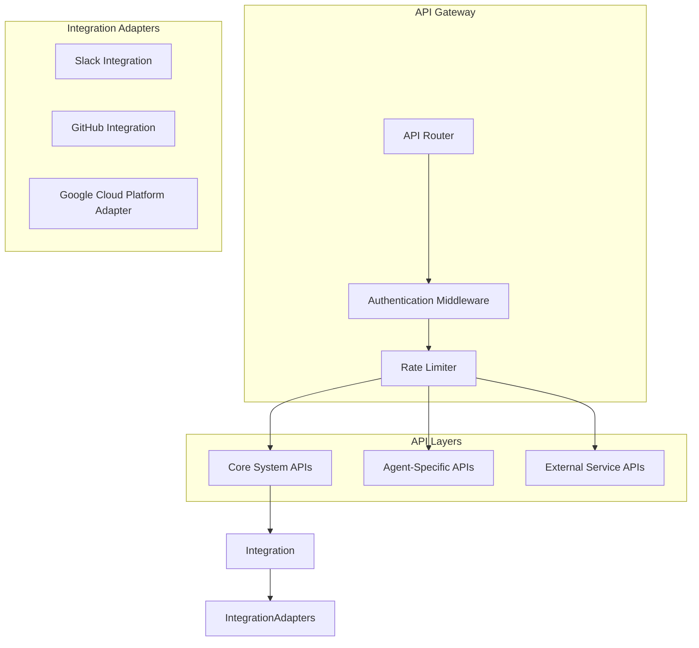

# Autonomos_AiLab: API Reference

## Overview
Date: 3/8/2025
Version: 1.0.0

## Table of Contents
- [Introduction](#introduction)
- [API Architecture](#api-architecture)
- [Core API Components](#core-api-components)
- [Agent APIs](#agent-apis)
- [External Service Integrations](#external-service-integrations)
- [Authentication and Authorization](#authentication-and-authorization)
- [Error Handling](#error-handling)
- [Rate Limiting](#rate-limiting)
- [API Versioning](#api-versioning)

## Introduction

The Autonomos_AiLab API ecosystem is designed to provide a flexible, secure, and extensible interface for interacting with our modular AI agent system. This document serves as a comprehensive reference for developers and integrators.

## API Architecture



## Core API Components

### API Router (`api/api_manager.py`)

The central routing mechanism for all API interactions.

#### Methods

1. `route_request(agent_type, request_data)`
   - **Description**: Dynamic routing to appropriate agent based on request
   - **Parameters**:
     - `agent_type`: Type of agent to handle the request
     - `request_data`: Payload for processing
   - **Returns**: Processed response from agent

2. `validate_request(request_data)`
   - **Description**: Validate incoming API requests
   - **Parameters**: `request_data`
   - **Returns**: Boolean indicating request validity

### Endpoint Registry (`api/endpoint_registry.py`)

Centralized management of API endpoints and their configurations.

#### Methods

1. `register_endpoint(endpoint_config)`
   - **Description**: Register a new API endpoint
   - **Parameters**: 
     ```python
     {
         "name": str,
         "path": str,
         "method": str,
         "handler": callable,
         "permissions": list
     }
     ```

2. `get_endpoint_config(endpoint_name)`
   - **Description**: Retrieve endpoint configuration

## Agent APIs

### Base Agent API (`agents/base_agent.py`)

#### Core Methods

1. `process_request(request)`
   - **Description**: Standard request processing method
   - **Parameters**: 
     - `request`: Input request object
   - **Returns**: Processed response

2. `adapt_context(context)`
   - **Description**: Dynamic context adaptation
   - **Parameters**: 
     - `context`: Current interaction context
   - **Returns**: Adapted context

### Specialized Agent APIs

#### Research Agent (`agents/search_research_agent.py`)

1. `conduct_research(query, sources=None)`
   - **Description**: Perform comprehensive research on a given query
   - **Parameters**:
     ```python
     {
         "query": str,  # Research topic
         "sources": list,  # Optional specific sources
         "depth": int,  # Research depth (default: 3)
         "language": str  # Output language (default: 'en')
     }
     ```
   - **Returns**: Structured research report

## External Service Integrations

### Slack Integration (`adapters/slack_integration.py`)

1. `process_slack_event(event)`
   - **Description**: Handle incoming Slack events
   - **Parameters**: Slack event payload
   - **Returns**: Processed response or action

### GitHub Integration (`adapters/github_integration.py`)

1. `sync_repository(repo_config)`
   - **Description**: Synchronize and analyze GitHub repositories
   - **Parameters**:
     ```python
     {
         "repo_url": str,
         "sync_type": str,  # 'full', 'metadata', 'content'
         "branches": list
     }
     ```

### Google Cloud Platform Integration (`agents/gcp_integration/`)

1. `workspace_document_loader(document_config)`
   - **Description**: Load and process Google Workspace documents
   - **Parameters**:
     ```python
     {
         "document_id": str,
         "processing_mode": str,  # 'extract', 'analyze', 'summarize'
         "output_format": str
     }
     ```

## Authentication and Authorization

### Credential Management (`security/credential_store.py`)

1. `get_credentials(service, user=None)`
   - **Description**: Securely retrieve credentials
   - **Parameters**:
     - `service`: Target service name
     - `user`: Optional user identifier
   - **Returns**: Secure credential object

2. `validate_credentials(credentials)`
   - **Description**: Validate credential integrity
   - **Parameters**: Credential object
   - **Returns**: Boolean validation result

## Error Handling

### Error Handler (`core/error_handler.py`)

1. `handle_api_error(error, context)`
   - **Description**: Standardized error handling and logging
   - **Parameters**:
     - `error`: Error object
     - `context`: Execution context
   - **Returns**: Standardized error response

## Rate Limiting

### Rate Limiter (`core/rate_limiter.py`)

1. `check_request_limit(user, endpoint)`
   - **Description**: Enforce API request limits
   - **Parameters**:
     - `user`: User identifier
     - `endpoint`: Requested API endpoint
   - **Returns**: Boolean (allow/deny request)

## API Versioning

- Current API Version: `v1.0.0`
- Versioning Strategy: Semantic Versioning
- Backward Compatibility: Maintained for major version

## Best Practices

1. Always use HTTPS
2. Include proper authentication tokens
3. Handle potential errors gracefully
4. Respect rate limits
5. Use appropriate logging

## Conclusion

The Autonomos_AiLab API provides a comprehensive, secure, and flexible interface for interacting with our AI agent system. By following these guidelines and understanding the API architecture, developers can effectively integrate and extend our platform.

---

**Autonomos_AiLab** - Connecting Intelligence, Empowering Innovation
