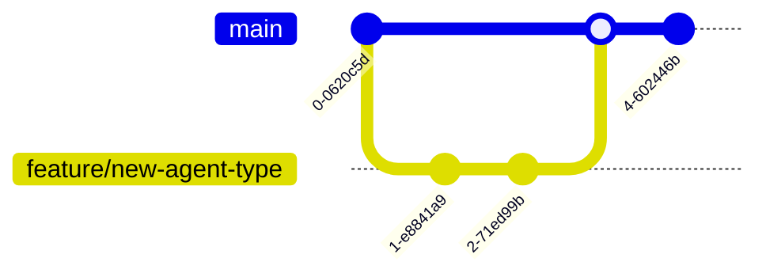

# Autonomos_AiLab: Contribution Guidelines

## Overview
Date: 3/8/2025
Version: 1.0.0

## Table of Contents
- [Welcome](#welcome)
- [Code of Conduct](#code-of-conduct)
- [How to Contribute](#how-to-contribute)
- [Development Setup](#development-setup)
- [Contribution Workflow](#contribution-workflow)
- [Code Quality Standards](#code-quality-standards)
- [Testing](#testing)
- [Documentation](#documentation)
- [Review Process](#review-process)
- [Communication](#communication)

## Welcome

Thank you for your interest in contributing to Autonomos_AiLab! We are building a cutting-edge, modular AI agent system, and we welcome contributions from the community.

## Code of Conduct

We are committed to providing a friendly, safe, and welcoming environment for all contributors. Our community is based on mutual respect, collaboration, and continuous learning.

### Our Pledge

- Respect diversity and inclusivity
- Be patient and supportive
- Provide constructive feedback
- Prioritize the community's well-being

### Unacceptable Behavior

- Harassment or discrimination
- Offensive or inappropriate language
- Personal attacks
- Trolling or insulting comments

## How to Contribute

There are multiple ways to contribute:

1. **Code Contributions**
   - Bug fixes
   - Feature implementations
   - Performance improvements
   - Documentation updates

2. **Non-Code Contributions**
   - Bug reporting
   - Feature suggestions
   - Documentation improvements
   - Community support

## Development Setup

### Prerequisites
- Python 3.9+
- Poetry
- Git
- Docker (optional)

### Local Setup

1. **Fork the Repository**
```bash
# Fork on GitHub, then clone your fork
git clone https://github.com/your-username/autonomos_team.git
cd autonomos_team
```

2. **Install Dependencies**
```bash
poetry install
```

3. **Set Up Pre-commit Hooks**
```bash
poetry run pre-commit install
```

4. **Create a Virtual Environment**
```bash
poetry shell
```

## Contribution Workflow

### Branch Strategy


### Steps to Contribute
1. Create an issue describing the contribution
2. Fork the repository
3. Create a feature branch
4. Make your changes
5. Write tests
6. Run pre-commit checks
7. Submit a Pull Request

### Commit Message Convention
```
<type>(<scope>): <description>

[optional body]

[optional footer]
```

#### Types
- `feat`: New feature
- `fix`: Bug fix
- `docs`: Documentation changes
- `style`: Code formatting
- `refactor`: Code restructuring
- `test`: Adding or modifying tests
- `chore`: Maintenance tasks

## Code Quality Standards

### Python Coding Guidelines
- Follow PEP 8 style guide
- Use type hints
- Write docstrings for all functions
- Implement comprehensive error handling

### Example of Good Code
```python
from typing import Dict, Any

def create_agent(config: Dict[str, Any]) -> Agent:
    """
    Create an AI agent with given configuration.

    Args:
        config: Configuration dictionary for agent initialization

    Returns:
        Initialized Agent instance

    Raises:
        ConfigurationError: If configuration is invalid
    """
    try:
        validate_config(config)
        return Agent(**config)
    except ValidationError as e:
        raise ConfigurationError(f"Invalid agent configuration: {e}")
```

## Testing

### Test Coverage
- Unit Tests: 90%+ coverage
- Integration Tests
- Edge Case Testing

### Running Tests
```bash
poetry run pytest
poetry run pytest --cov=.
```

### Test Types
- Unit Tests
- Integration Tests
- Performance Tests
- Security Tests

## Documentation

### Documentation Requirements
- Update README if needed
- Document new features
- Update API references
- Include usage examples

## Review Process

### Pull Request Checklist
- [ ] Follows code style guidelines
- [ ] Includes tests
- [ ] Updates documentation
- [ ] Passes all CI checks
- [ ] Reviewed by at least two maintainers

### Review Stages
1. Automated Checks
2. Code Review
3. Performance Review
4. Security Review
5. Merge Approval

## Communication Channels

- **GitHub Issues**: Bug reports, feature requests
- **Slack Channel**: `#autonomos-contributors`
- **Email**: contributors@autonomos-ailab.com

## Recognition

Contributors will be recognized in:
- Project README
- Release Notes
- Contributor Hall of Fame

## Conclusion

Your contributions are vital to the success of Autonomos_AiLab. We appreciate your effort and commitment to building an innovative AI agent system.

---

**Autonomos_AiLab** - Innovating Together, Advancing Intelligence
