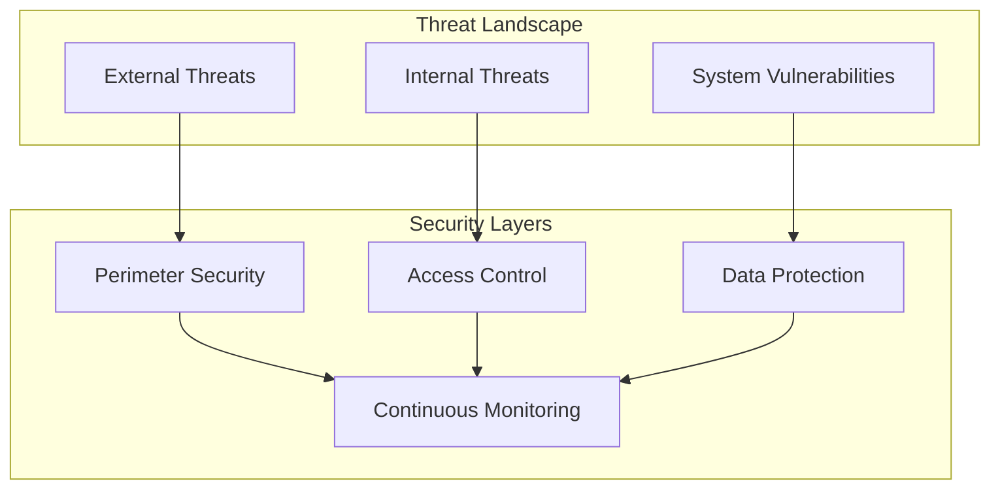
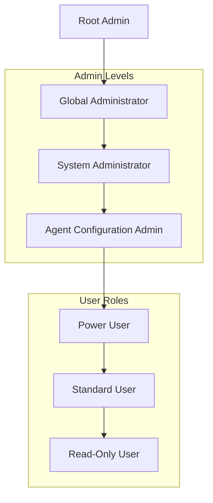
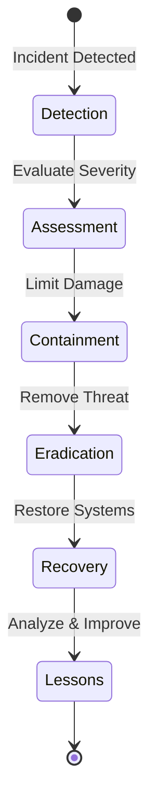

# Autonomos_AiLab: Security Policy

## Overview
Date: 3/8/2025
Version: 1.0.0

## Table of Contents
- [Security Philosophy](#security-philosophy)
- [Threat Model](#threat-model)
- [Access Control](#access-control)
- [Data Protection](#data-protection)
- [Authentication](#authentication)
- [Network Security](#network-security)
- [Dependency Management](#dependency-management)
- [Incident Response](#incident-response)
- [Compliance](#compliance)
- [Security Best Practices](#security-best-practices)

## Security Philosophy

At Autonomos_AiLab, security is not an afterthought but a fundamental design principle. Our approach is proactive, comprehensive, and adaptive, focusing on:
- Defense in Depth
- Least Privilege Principle
- Continuous Monitoring
- Rapid Incident Response

## Threat Model



### Identified Threat Categories
1. Unauthorized Access
2. Data Exfiltration
3. Injection Attacks
4. Denial of Service
5. Credential Compromise
6. AI Model Manipulation

## Access Control

### Authentication Mechanisms
- Multi-Factor Authentication (MFA)
- Role-Based Access Control (RBAC)
- Just-In-Time (JIT) Access Provisioning

#### Authentication Implementation
```python
class AuthenticationManager:
    @staticmethod
    def validate_access(user, resource, required_permissions):
        """
        Validate user access with multi-layered checks
        """
        if not user.is_authenticated:
            raise UnauthorizedAccessError()
        
        if not user.has_permissions(required_permissions):
            raise InsufficientPermissionsError()
        
        # Additional contextual checks
        if not _verify_device_integrity(user.device):
            raise DeviceCompromiseError()
```

### Permission Hierarchy


## Data Protection

### Sensitive Data Handling
- Encryption at Rest (AES-256)
- Encryption in Transit (TLS 1.3)
- Tokenization of Sensitive Information
- Automatic PII Redaction

#### PII Sanitization Example
```python
class PIIHandler:
    @staticmethod
    def sanitize(data):
        """
        Remove or mask Personally Identifiable Information
        """
        sanitized_data = {
            k: _mask_sensitive_value(v) 
            for k, v in data.items() 
            if not _is_pii_safe(v)
        }
        return sanitized_data
```

## Authentication

### Credential Management
- Centralized Credential Store
- Automatic Credential Rotation
- Hardware Security Module (HSM) Integration

### OAuth and Token Management
- Short-lived Access Tokens
- Refresh Token Rotation
- Revocable Credentials

## Network Security

### Firewall and Network Segmentation
- Strict Inbound/Outbound Rules
- Micro-Segmentation
- Web Application Firewall (WAF)

### Network Protection Strategies
- IP Whitelisting
- DDoS Mitigation
- Traffic Encryption
- Regular Vulnerability Scanning

## Dependency Management

### Secure Dependency Workflow
1. Automated Vulnerability Scanning
2. Dependency Version Pinning
3. Regular Security Audits

#### Dependency Check Script
```python
def audit_dependencies():
    """
    Comprehensive dependency security audit
    """
    vulnerabilities = []
    
    for package in project_dependencies:
        vuln_check = security_scanner.check(package)
        if vuln_check.has_vulnerabilities:
            vulnerabilities.append(vuln_check)
    
    if vulnerabilities:
        alert_security_team(vulnerabilities)
```

## Incident Response

### Incident Classification
- Severity Levels
- Predefined Response Protocols
- Forensic Analysis Procedures

### Incident Response Workflow


## Compliance

### Regulatory Frameworks
- GDPR
- CCPA
- HIPAA (if applicable)
- SOC 2
- ISO 27001

## Security Best Practices

1. Regular Security Training
2. Continuous Monitoring
3. Automated Security Testing
4. Penetration Testing
5. Bug Bounty Program
6. Security-First Development

## Reporting Security Issues

### Vulnerability Disclosure
- Email: security@autonomos-ailab.com
- PGP Key Available
- Responsible Disclosure Policy

## Conclusion

Security is a continuous journey. Autonomos_AiLab is committed to maintaining the highest standards of security, protecting our users, and continuously evolving our security practices.

---

**Autonomos_AiLab** - Securing Intelligence, Protecting Innovation
