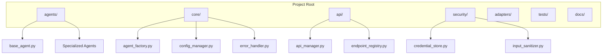

# Autonomos_AiLab: Development Guide

## Overview
Date: 3/8/2025
Version: 1.0.0

## Table of Contents
- [Development Environment](#development-environment)
- [Project Structure](#project-structure)
- [Agent Development](#agent-development)
- [Core Components](#core-components)
- [Testing Strategies](#testing-strategies)
- [Code Quality](#code-quality)
- [Performance Optimization](#performance-optimization)
- [Debugging Techniques](#debugging-techniques)
- [Advanced Development](#advanced-development)

## Development Environment

### Prerequisites
- Python 3.9+
- Poetry (Dependency Management)
- Docker
- VSCode or PyCharm
- Pre-commit Hooks

### Local Setup
```bash
# Clone the repository
git clone https://github.com/Autonomos_AiLab/autonomos_team.git
cd autonomos_team

# Install Poetry
curl -sSL https://install.python-poetry.org | python3 -

# Install dependencies
poetry install

# Set up pre-commit hooks
poetry run pre-commit install
```

## Project Structure



## Agent Development

### Base Agent Implementation
```python
from typing import Dict, Any
from core.base_components import BaseComponent

class Agent(BaseComponent):
    def __init__(self, config: Dict[str, Any]):
        """
        Initialize agent with configuration
        
        Args:
            config: Agent-specific configuration
        """
        self.config = config
        self._validate_config()
    
    def _validate_config(self):
        """
        Validate agent configuration
        """
        # Implement configuration validation logic
        pass
    
    def process_request(self, request: Dict[str, Any]) -> Dict[str, Any]:
        """
        Process incoming request
        
        Args:
            request: Input request data
        
        Returns:
            Processed response
        """
        raise NotImplementedError("Subclasses must implement request processing")
    
    def adapt_context(self, context: Dict[str, Any]):
        """
        Dynamically adapt agent context
        
        Args:
            context: Current interaction context
        """
        # Implement context adaptation logic
        pass
```

### Creating a Specialized Agent
```python
class ResearchAgent(Agent):
    def __init__(self, config):
        super().__init__(config)
        self.research_depth = config.get('research_depth', 3)
    
    def process_request(self, request):
        # Implement specialized research logic
        query = request.get('query')
        sources = request.get('sources', [])
        
        return self._conduct_research(query, sources)
    
    def _conduct_research(self, query, sources):
        # Implement research methodology
        pass
```

## Core Components

### Agent Factory
```python
class AgentFactory:
    @staticmethod
    def create_agent(agent_type: str, config: Dict[str, Any]) -> Agent:
        """
        Dynamically create agents based on type
        
        Args:
            agent_type: Type of agent to create
            config: Agent configuration
        
        Returns:
            Instantiated agent
        """
        agent_registry = {
            'research': ResearchAgent,
            'analysis': AnalysisAgent,
            # Add more agent types
        }
        
        AgentClass = agent_registry.get(agent_type)
        if not AgentClass:
            raise ValueError(f"Unknown agent type: {agent_type}")
        
        return AgentClass(config)
```

## Testing Strategies

### Unit Testing
```python
import pytest
from agents.research_agent import ResearchAgent

def test_research_agent_initialization():
    config = {
        'research_depth': 5,
        'sources': ['academic', 'web']
    }
    agent = ResearchAgent(config)
    
    assert agent.research_depth == 5
    assert len(agent.config['sources']) == 2

def test_research_agent_request_processing():
    agent = ResearchAgent({})
    request = {
        'query': 'AI Ethics',
        'sources': ['academic journals']
    }
    
    response = agent.process_request(request)
    
    assert response is not None
    # Add more specific assertions
```

## Code Quality

### Linting and Formatting
- Use `flake8` for linting
- Use `black` for code formatting
- Use `mypy` for static type checking

### Pre-commit Configuration
```yaml
repos:
-   repo: https://github.com/pre-commit/pre-commit-hooks
    rev: v4.1.0
    hooks:
    -   id: trailing-whitespace
    -   id: end-of-file-fixer

-   repo: https://github.com/psf/black
    rev: 22.3.0
    hooks:
    -   id: black

-   repo: https://github.com/PyCQA/flake8
    rev: 4.0.1
    hooks:
    -   id: flake8
```

## Performance Optimization

### Profiling and Optimization
- Use `cProfile` for performance analysis
- Implement caching mechanisms
- Use `asyncio` for concurrent operations

## Debugging Techniques

### Logging and Tracing
```python
import logging
from core.structured_logger import StructuredLogger

class AgentDebugger:
    def __init__(self, agent):
        self.agent = agent
        self.logger = StructuredLogger(agent.__class__.__name__)
    
    def trace_method_call(self, method, *args, **kwargs):
        """
        Trace method calls with detailed logging
        """
        self.logger.info(f"Calling {method.__name__}", 
                         extra={
                             'args': args,
                             'kwargs': kwargs
                         })
        result = method(*args, **kwargs)
        self.logger.info(f"{method.__name__} completed", 
                         extra={'result': result})
        return result
```

## Advanced Development

### Extending the Framework
- Create custom agent base classes
- Implement new integration adapters
- Develop advanced context management strategies

## Conclusion

This development guide provides a comprehensive overview of developing agents and components for the Autonomos_AiLab system. Continuous learning, adherence to best practices, and innovative thinking are key to success.

---

**Autonomos_AiLab** - Developing Intelligence, Empowering Innovation
