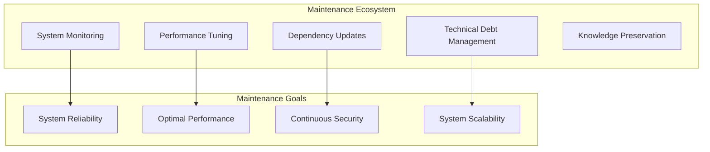

# Autonomos_AiLab: Maintenance Guide

## Overview
Date: 3/8/2025
Version: 1.0.0

## Table of Contents
- [Maintenance Philosophy](#maintenance-philosophy)
- [System Health Monitoring](#system-health-monitoring)
- [Dependency Management](#dependency-management)
- [Version Control](#version-control)
- [Performance Optimization](#performance-optimization)
- [Backup and Recovery](#backup-and-recovery)
- [Upgrade Procedures](#upgrade-procedures)
- [Technical Debt Management](#technical-debt-management)
- [Knowledge Management](#knowledge-management)

## Maintenance Philosophy

At Autonomos_AiLab, maintenance is a proactive, continuous process of ensuring system reliability, performance, and adaptability. Our approach focuses on:
- Preventive care
- Continuous improvement
- Minimal disruption
- Predictive maintenance



## System Health Monitoring

### Monitoring Tools
- Prometheus for metrics collection
- Grafana for visualization
- ELK Stack for log management

### Key Metrics to Track
- System Resource Utilization
- Agent Performance
- API Response Times
- Error Rates
- Memory Consumption

### Monitoring Script Example
```python
class SystemHealthMonitor:
    def __init__(self, monitoring_config):
        self.config = monitoring_config
        self.metrics_collector = PrometheusCollector()
    
    def collect_system_metrics(self):
        """
        Collect and log comprehensive system metrics
        """
        metrics = {
            'cpu_usage': psutil.cpu_percent(),
            'memory_usage': psutil.virtual_memory().percent,
            'active_agents': self.count_active_agents(),
            'api_response_time': self.measure_api_response_time()
        }
        
        self.metrics_collector.record_metrics(metrics)
        self._trigger_alerts_if_needed(metrics)
```

## Dependency Management

### Dependency Update Strategy
1. Weekly Dependency Checks
2. Automated Vulnerability Scanning
3. Staged Rollout of Updates
4. Comprehensive Testing

### Dependency Update Script
```python
def update_dependencies():
    """
    Automated dependency update workflow
    """
    # Check for updates
    updates = poetry.check_updates()
    
    # Run security scan
    vulnerabilities = safety.check(updates)
    
    if not vulnerabilities:
        # Apply updates in staging environment
        with StagingEnvironment():
            poetry.update()
            run_comprehensive_tests()
        
        # If tests pass, update production
        deploy_updates()
```

## Version Control

### Versioning Strategy
- Semantic Versioning (SemVer)
- Feature Branch Workflow
- Trunk-Based Development

### Version Management


## Performance Optimization

### Optimization Techniques
- Caching Mechanisms
- Asynchronous Processing
- Resource Pool Management
- Lazy Loading

### Performance Optimization Example
```python
class ResourceOptimizer:
    def __init__(self, agent_pool):
        self.agent_pool = agent_pool
        self.resource_cache = LRUCache()
    
    def optimize_agent_resources(self):
        """
        Dynamically optimize agent resource allocation
        """
        for agent in self.agent_pool:
            if agent.is_resource_intensive():
                self._reallocate_resources(agent)
```

## Backup and Recovery

### Backup Strategies
- Incremental Backups
- Multi-Region Redundancy
- Point-in-Time Recovery
- Encrypted Backup Storage

### Backup Configuration
```python
class BackupManager:
    def create_backup(self, backup_config):
        """
        Create comprehensive system backup
        """
        backup_locations = [
            'local_storage',
            's3_encrypted_bucket',
            'offsite_backup_location'
        ]
        
        for location in backup_locations:
            self._backup_to_location(location, backup_config)
```

## Upgrade Procedures

### Upgrade Workflow
1. Pre-Upgrade Compatibility Check
2. Staging Environment Deployment
3. Comprehensive Testing
4. Gradual Production Rollout
5. Rollback Mechanism

### Upgrade Script
```python
def perform_system_upgrade(version):
    """
    Systematic system upgrade procedure
    """
    pre_upgrade_checks()
    
    with StagingEnvironment():
        deploy_new_version(version)
        run_integration_tests()
        validate_system_compatibility()
    
    if tests_passed:
        perform_blue_green_deployment()
    else:
        trigger_rollback()
```

## Technical Debt Management

### Debt Reduction Strategies
- Regular Refactoring
- Code Quality Reviews
- Architectural Assessments
- Incremental Improvements

### Technical Debt Tracker
```python
class TechnicalDebtManager:
    def assess_technical_debt(self):
        """
        Comprehensive technical debt assessment
        """
        debt_metrics = {
            'code_complexity': analyze_code_complexity(),
            'outdated_dependencies': check_dependency_age(),
            'test_coverage': calculate_test_coverage()
        }
        
        prioritize_debt_reduction(debt_metrics)
```

## Knowledge Management

### Knowledge Preservation
- Comprehensive Documentation
- Architecture Decision Records
- Regular Knowledge Sharing Sessions
- Internal Wiki Maintenance

## Conclusion

Effective maintenance is the backbone of a robust, evolving AI system. By embracing proactive strategies and continuous improvement, Autonomos_AiLab ensures our platform remains cutting-edge and reliable.

---

**Autonomos_AiLab** - Maintaining Intelligence, Ensuring Excellence
