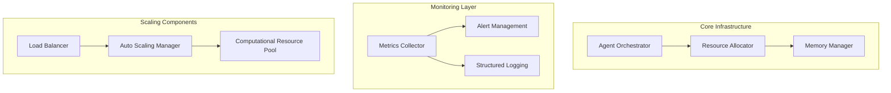
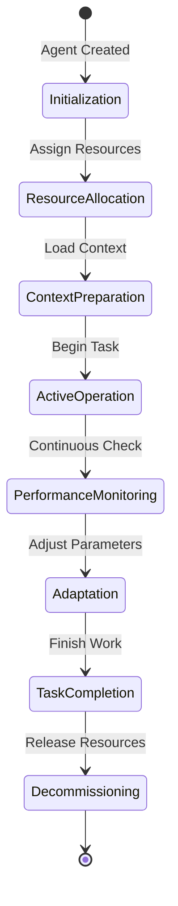
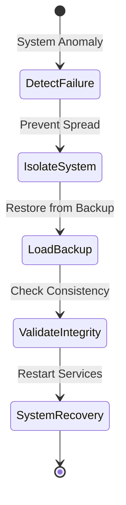

# Autonomos_AiLab: Operations Manual

## Overview
Date: 3/8/2025
Version: 1.0.0

## Table of Contents
- [System Architecture](#system-architecture)
- [Operational Workflows](#operational-workflows)
- [Monitoring and Observability](#monitoring-and-observability)
- [Performance Management](#performance-management)
- [Maintenance Procedures](#maintenance-procedures)
- [Scaling Strategies](#scaling-strategies)
- [Backup and Recovery](#backup-and-recovery)
- [Incident Management](#incident-management)
- [Compliance and Auditing](#compliance-and-auditing)

## System Architecture Overview



## Operational Workflows

### Agent Lifecycle Management
1. **Initialization**
   - Validate agent configuration
   - Allocate computational resources
   - Initialize memory context

2. **Active Operation**
   - Continuous performance monitoring
   - Dynamic resource adjustment
   - Context adaptation

3. **Decommissioning**
   - Graceful shutdown
   - Resource release
   - Logging of final state

### Workflow Diagram


## Monitoring and Observability

### Metrics Tracking
- **System Metrics**
  - CPU Utilization
  - Memory Consumption
  - Network Throughput
  - Agent Concurrency

- **Agent Performance Metrics**
  - Task Completion Rate
  - Response Latency
  - Error Rates
  - Resource Efficiency

### Monitoring Tools
- Prometheus for metrics collection
- Grafana for visualization
- ELK Stack for log management

### Monitoring Configuration Example
```python
class OperationsMonitor:
    def collect_system_metrics(self):
        """
        Collect comprehensive system performance metrics
        """
        metrics = {
            'cpu_usage': psutil.cpu_percent(),
            'memory_usage': psutil.virtual_memory().percent,
            'active_agents': self.count_active_agents(),
            'task_queue_length': self.get_task_queue_size()
        }
        self.log_metrics(metrics)
        self.trigger_alerts_if_needed(metrics)
```

## Performance Management

### Resource Allocation Strategies
- Dynamic Resource Scaling
- Predictive Resource Provisioning
- Workload-Based Allocation

### Performance Optimization Techniques
- Caching Mechanisms
- Asynchronous Processing
- Parallel Computation
- Intelligent Agent Routing

## Maintenance Procedures

### Routine Maintenance
1. **Weekly Tasks**
   - System Health Check
   - Dependency Updates
   - Performance Analysis

2. **Monthly Tasks**
   - Comprehensive Security Audit
   - Performance Optimization
   - Capacity Planning

3. **Quarterly Tasks**
   - Infrastructure Review
   - Architecture Evaluation
   - Long-term Scaling Strategy

## Scaling Strategies

### Horizontal Scaling
- Stateless Agent Design
- Containerization
- Kubernetes Orchestration

### Vertical Scaling
- Dynamic Resource Allocation
- Machine Learning-Driven Scaling
- Predictive Resource Management

## Backup and Recovery

### Backup Strategies
- Distributed Backup System
- Incremental Backup
- Point-in-Time Recovery
- Multi-Region Redundancy

### Recovery Workflow


## Incident Management

### Incident Classification
- **Severity Levels**
  - Level 1: Critical System Failure
  - Level 2: Major Performance Degradation
  - Level 3: Minor Operational Issue

### Incident Response Procedure
1. Detection and Alerting
2. Initial Assessment
3. Containment
4. Eradication
5. Recovery
6. Post-Incident Analysis

## Compliance and Auditing

### Audit Trails
- Comprehensive Logging
- Immutable Log Records
- Cryptographic Log Signing

### Compliance Frameworks
- GDPR
- CCPA
- SOC 2
- ISO 27001

## Conclusion

Effective operations are crucial to the success of Autonomos_AiLab. This manual provides a comprehensive guide to maintaining, monitoring, and optimizing our AI agent system.

---

**Autonomos_AiLab** - Operational Excellence, Intelligent Systems
