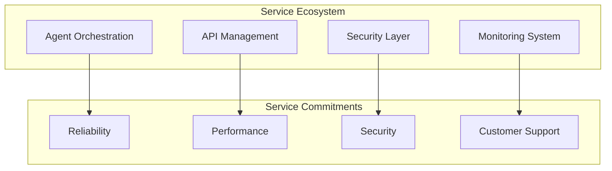
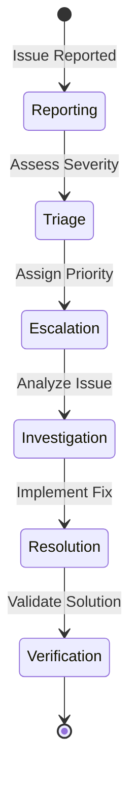

# Autonomos_AiLab: Service Level Agreement (SLA)

## Overview
Date: 3/8/2025
Version: 1.0.0

## Table of Contents
- [Service Definition](#service-definition)
- [Performance Guarantees](#performance-guarantees)
- [Availability](#availability)
- [Response Times](#response-times)
- [Support Levels](#support-levels)
- [Incident Management](#incident-management)
- [Compensation](#compensation)
- [Exclusions](#exclusions)
- [Compliance](#compliance)

## Service Definition

Autonomos_AiLab provides a modular, intelligent AI agent system designed to deliver adaptive, high-performance solutions across multiple domains.



## Performance Guarantees

### System Performance Metrics
- **Uptime**: 99.95% monthly
- **Response Time**: 
  - Standard Queries: < 500ms
  - Complex AI Tasks: < 3 seconds
- **Scalability**: Dynamically handle up to 10,000 concurrent agent requests

### Performance Monitoring
```python
class SLAPerformanceMonitor:
    def validate_performance(self, metrics):
        """
        Validate system performance against SLA commitments
        """
        sla_checks = {
            'uptime': metrics['monthly_uptime'] >= 99.95,
            'standard_query_response': metrics['avg_standard_query_time'] < 500,
            'complex_query_response': metrics['avg_complex_query_time'] < 3000,
            'concurrent_request_capacity': metrics['max_concurrent_requests'] >= 10000
        }
        
        return all(sla_checks.values())
```

## Availability

### Availability Tiers
1. **Platinum Tier**: 99.99% Uptime
2. **Gold Tier**: 99.95% Uptime
3. **Silver Tier**: 99.90% Uptime

### Availability Calculation
- Monthly Availability = (Total Minutes - Downtime) / Total Minutes * 100%
- Planned maintenance excluded from downtime calculation

## Response Times

### Response Time Guarantees
- **Initial Response**: 
  - Critical Issues: < 15 minutes
  - High Priority: < 1 hour
  - Standard: < 4 hours
- **Resolution Time**:
  - Critical: < 4 hours
  - High Priority: < 24 hours
  - Standard: < 72 hours

### Incident Response Workflow


## Support Levels

### Support Channels
- Email Support
- Slack Enterprise Channel
- Dedicated Support Portal
- Phone Support (Platinum Tier)

### Support Response Matrix
| Severity | Platinum | Gold | Silver |
|----------|----------|------|--------|
| Critical | 15 min   | 30 min| 1 hour |
| High     | 1 hour   | 2 hours| 4 hours|
| Standard | 4 hours  | 8 hours| 24 hours|

## Incident Management

### Incident Classification
- **Critical**: System-wide failure, complete service disruption
- **High**: Significant performance degradation, partial service loss
- **Standard**: Minor issues, localized problems

### Incident Escalation Protocol
1. Immediate Notification
2. Dedicated Response Team Activation
3. Continuous Status Updates
4. Root Cause Analysis
5. Preventive Measure Implementation

## Compensation

### Service Credit Structure
- 99.90% - 99.95% Uptime: 10% Monthly Service Credit
- 99.50% - 99.89% Uptime: 25% Monthly Service Credit
- < 99.50% Uptime: 50% Monthly Service Credit

### Credit Redemption
- Applicable to future service invoices
- Valid for 12 months from issue date
- Non-transferable

## Exclusions

### Non-Covered Scenarios
- Scheduled Maintenance
- Force Majeure Events
- Customer-Induced Incidents
- Third-Party Service Disruptions
- Unauthorized System Modifications

## Compliance

### Regulatory Frameworks
- GDPR Compliance
- CCPA Data Protection
- SOC 2 Security Standards
- ISO 27001 Information Security

### Audit and Verification
- Quarterly Performance Audits
- Annual Comprehensive Review
- Transparent Reporting

## Modification of SLA

- SLA subject to modification with 30-day notice
- Customer will be notified of any changes
- Continued use of service implies acceptance of updated SLA

## Conclusion

This Service Level Agreement represents our commitment to delivering a reliable, high-performance AI agent system. We strive to exceed these commitments and provide exceptional service.

---

**Autonomos_AiLab** - Committed to Excellence, Delivering Intelligence
