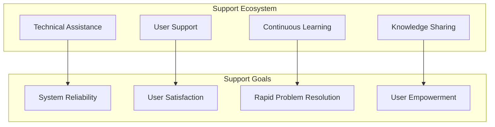
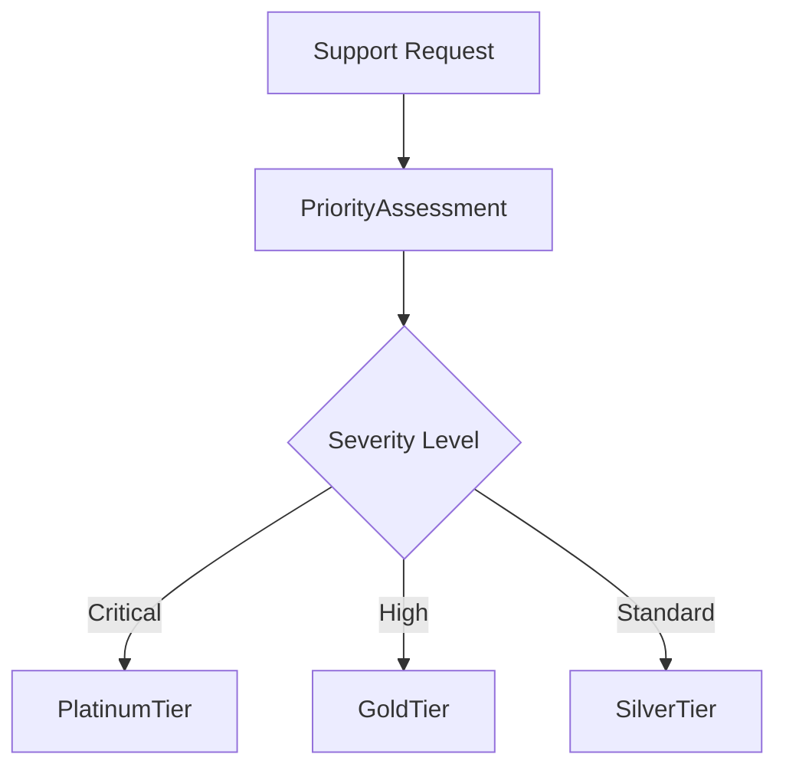

# Autonomos_AiLab: Support Plan

## Overview
Date: 3/8/2025
Version: 1.0.0

## Table of Contents
- [Support Philosophy](#support-philosophy)
- [Support Channels](#support-channels)
- [Support Tiers](#support-tiers)
- [Escalation Procedures](#escalation-procedures)
- [Knowledge Base](#knowledge-base)
- [Community Support](#community-support)
- [Training and Onboarding](#training-and-onboarding)
- [Feedback Mechanism](#feedback-mechanism)
- [Continuous Improvement](#continuous-improvement)

## Support Philosophy

At Autonomos_AiLab, our support is more than just problem-solving—it's about empowering our users, fostering innovation, and ensuring the seamless operation of our AI agent system.



## Support Channels

### Primary Support Channels
1. **Email Support**
   - support@autonomos-ailab.com
   - Guaranteed response within SLA timeframes

2. **Slack Enterprise Channel**
   - Dedicated support workspace
   - Real-time communication
   - Community-driven problem-solving

3. **Support Portal**
   - Ticket management
   - Knowledge base access
   - Self-service resources

4. **Phone Support**
   - Available for Platinum Tier customers
   - Direct line to technical experts

### Support Channel Implementation
```python
class SupportChannelManager:
    def route_support_request(self, request):
        """
        Intelligently route support requests
        """
        priority = self._calculate_priority(request)
        channel = self._select_optimal_channel(priority)
        
        return channel.process_request(request)
```

## Support Tiers

### Tier Comparison
| Feature | Silver | Gold | Platinum |
|---------|--------|------|----------|
| Response Time | 24 hours | 2 hours | 15 minutes |
| Dedicated Support | No | No | Yes |
| Phone Support | No | No | Yes |
| Priority Escalation | Low | Medium | High |
| Training Sessions | Basic | Advanced | Comprehensive |

### Tier Selection Workflow


## Escalation Procedures

### Incident Escalation Matrix
1. **Tier 1**: First-line Support
   - Initial triage
   - Basic troubleshooting
   - Knowledge base consultation

2. **Tier 2**: Technical Support
   - Advanced diagnostic
   - In-depth system analysis
   - Complex issue resolution

3. **Tier 3**: Expert Engineering
   - Critical system issues
   - Architecture-level problem-solving
   - Direct engagement with core development team

### Escalation Workflow
```python
class SupportEscalationManager:
    def escalate_incident(self, incident):
        """
        Systematic incident escalation
        """
        current_tier = self._get_current_support_tier(incident)
        
        if not current_tier.can_resolve():
            next_tier = self._get_next_support_tier(current_tier)
            next_tier.take_ownership(incident)
```

## Knowledge Base

### Knowledge Management
- Comprehensive documentation
- Troubleshooting guides
- Video tutorials
- API reference materials
- Community-contributed solutions

### Knowledge Base Features
- Full-text search
- Version-specific guides
- User-rated solutions
- Continuous updates

## Community Support

### Community Engagement
- GitHub Discussions
- Stack Overflow Tag
- Monthly Community Webinars
- User Group Meetups
- Open-Source Contribution

## Training and Onboarding

### Training Programs
1. **Quickstart Workshops**
   - System fundamentals
   - Basic agent configuration

2. **Advanced Training**
   - Custom agent development
   - Advanced integration techniques
   - Performance optimization

3. **Certification Program**
   - Autonomos_AiLab Certified Developer
   - Specialized agent design certification

## Feedback Mechanism

### Continuous Feedback Loop
- Post-support satisfaction surveys
- Quarterly user experience reviews
- Feature request tracking
- Public roadmap

### Feedback Processing
```python
class FeedbackProcessor:
    def analyze_support_feedback(self, feedback_data):
        """
        Transform user feedback into actionable insights
        """
        sentiment_analysis = self._perform_sentiment_analysis(feedback_data)
        improvement_areas = self._identify_improvement_areas(sentiment_analysis)
        
        self._update_support_strategy(improvement_areas)
```

## Continuous Improvement

### Improvement Strategies
- Regular support process audits
- Machine learning-driven support optimization
- Proactive issue prediction
- Continuous training for support team

## Conclusion

Our support plan is designed to provide exceptional, user-centric assistance that goes beyond traditional support models. We are committed to your success.

---

**Autonomos_AiLab** - Supporting Intelligence, Enabling Innovation
