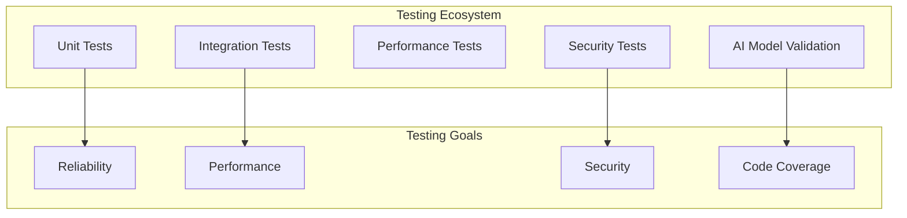
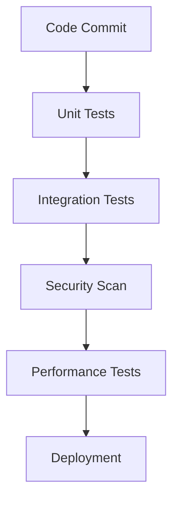

# Autonomos_AiLab: Testing Strategy

## Overview
Date: 3/8/2025
Version: 1.0.0

## Table of Contents
- [Testing Philosophy](#testing-philosophy)
- [Test Types](#test-types)
- [Testing Framework](#testing-framework)
- [Test Coverage](#test-coverage)
- [Performance Testing](#performance-testing)
- [Security Testing](#security-testing)
- [AI Model Validation](#ai-model-validation)
- [Continuous Integration](#continuous-integration)
- [Test Environment](#test-environment)

## Testing Philosophy

At Autonomos_AiLab, testing is not just a phase but an integral part of our development process. Our testing strategy focuses on:
- Comprehensive coverage
- Reliability
- Performance
- Security
- Continuous improvement



## Test Types

### 1. Unit Testing
- Test individual components in isolation
- Validate specific function behaviors
- Ensure component-level reliability

#### Example Unit Test
```python
def test_agent_initialization():
    config = {
        'model': 'gpt-3.5-turbo',
        'max_tokens': 1024
    }
    agent = ResearchAgent(config)
    
    assert agent.config['model'] == 'gpt-3.5-turbo'
    assert agent.config['max_tokens'] == 1024
```

### 2. Integration Testing
- Test interactions between components
- Validate system-level workflows
- Ensure seamless component communication

#### Integration Test Example
```python
def test_agent_api_integration():
    api_manager = APIManager()
    research_agent = ResearchAgent()
    
    request = {
        'query': 'AI Ethics',
        'sources': ['academic', 'web']
    }
    
    response = api_manager.route_request('research', request)
    
    assert response is not None
    assert 'research_results' in response
```

### 3. Performance Testing
- Measure system response times
- Validate resource utilization
- Identify bottlenecks

### 4. Security Testing
- Vulnerability scanning
- Penetration testing
- Input validation
- Access control verification

### 5. AI Model Validation
- Bias detection
- Performance consistency
- Generalization testing

## Testing Framework

### Primary Testing Tools
- `pytest`: Test runner and framework
- `coverage.py`: Code coverage analysis
- `hypothesis`: Property-based testing
- `locust`: Performance and load testing

### Configuration Example
```python
# conftest.py
import pytest
from core.agent_factory import AgentFactory

@pytest.fixture
def agent_factory():
    return AgentFactory()

@pytest.fixture
def mock_config():
    return {
        'model': 'test-model',
        'max_tokens': 512
    }
```

## Test Coverage

### Coverage Targets
- Unit Tests: 90%+
- Integration Tests: 80%+
- Critical Path Coverage: 100%

### Coverage Configuration
```bash
# Run tests with coverage
poetry run pytest --cov=. --cov-report=xml
```

## Performance Testing

### Performance Test Scenarios
- Concurrent Agent Execution
- Large Dataset Processing
- Resource Constraint Scenarios

### Performance Metrics
- Response Time
- Memory Consumption
- CPU Utilization
- Scalability

## Security Testing

### Security Test Categories
- Input Validation
- Authentication Bypass
- Data Exposure
- Injection Vulnerabilities

### Security Testing Tools
- `bandit`: Python security linter
- `safety`: Dependency vulnerability scanner

## AI Model Validation

### Validation Techniques
- Bias Detection
- Adversarial Testing
- Generalization Assessment
- Consistency Checks

### Validation Framework
```python
class AIModelValidator:
    def test_model_bias(self, model, test_dataset):
        """
        Detect potential biases in AI model
        """
        bias_metrics = self._calculate_bias_metrics(model, test_dataset)
        assert bias_metrics['bias_score'] < BIAS_THRESHOLD
    
    def test_model_generalization(self, model, test_cases):
        """
        Validate model performance across diverse scenarios
        """
        generalization_score = self._evaluate_generalization(model, test_cases)
        assert generalization_score > GENERALIZATION_THRESHOLD
```

## Continuous Integration

### CI/CD Pipeline


### GitHub Actions Configuration
```yaml
name: CI Pipeline
on: [push, pull_request]

jobs:
  test:
    runs-on: ubuntu-latest
    steps:
    - uses: actions/checkout@v2
    - name: Set up Python
      uses: actions/setup-python@v2
      with:
        python-version: 3.9
    - name: Install dependencies
      run: |
        pip install poetry
        poetry install
    - name: Run tests
      run: poetry run pytest
    - name: Security scan
      run: poetry run safety check
```

## Test Environment

### Environment Configurations
- Development
- Staging
- Production
- Isolated Test Environments

## Conclusion

Our comprehensive testing strategy ensures the reliability, performance, and security of the Autonomos_AiLab AI agent system. Continuous improvement and rigorous validation are key to our success.

---

**Autonomos_AiLab** - Testing Intelligence, Ensuring Excellence
