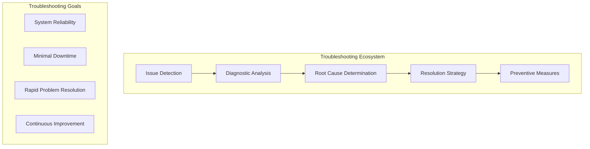
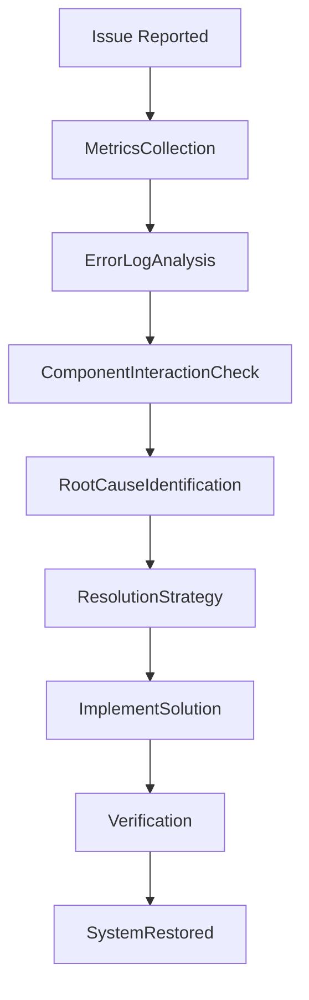
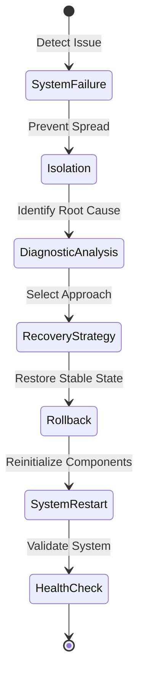

# Autonomos_AiLab: Troubleshooting Guide

## Overview
Date: 3/8/2025
Version: 1.0.0

## Table of Contents
- [Autonomos\_AiLab: Troubleshooting Guide](#autonomos_ailab-troubleshooting-guide)
  - [Overview](#overview)
  - [Table of Contents](#table-of-contents)
  - [Troubleshooting Philosophy](#troubleshooting-philosophy)
  - [Common Issue Categories](#common-issue-categories)
  - [Diagnostic Workflow](#diagnostic-workflow)
    - [Systematic Troubleshooting Process](#systematic-troubleshooting-process)
    - [Diagnostic Decision Tree](#diagnostic-decision-tree)
  - [Agent-Specific Troubleshooting](#agent-specific-troubleshooting)
    - [Research Agent Troubleshooting](#research-agent-troubleshooting)
  - [Performance Issues](#performance-issues)
    - [Performance Diagnostic Toolkit](#performance-diagnostic-toolkit)
    - [Performance Diagnostic Script](#performance-diagnostic-script)
  - [Connectivity Problems](#connectivity-problems)
    - [Connectivity Troubleshooting](#connectivity-troubleshooting)
  - [Security and Access Issues](#security-and-access-issues)
    - [Security Diagnostic Workflow](#security-diagnostic-workflow)
  - [Logging and Monitoring](#logging-and-monitoring)
    - [Logging Best Practices](#logging-best-practices)
    - [Logging Configuration](#logging-configuration)
  - [Recovery Procedures](#recovery-procedures)
    - [Recovery Strategies](#recovery-strategies)
    - [Recovery Workflow](#recovery-workflow)
  - [Conclusion](#conclusion)

## Troubleshooting Philosophy

At Autonomos_AiLab, troubleshooting is a systematic, methodical approach to identifying, diagnosing, and resolving system issues with minimal disruption.



## Common Issue Categories

1. **Agent Performance Degradation**
2. **API Integration Failures**
3. **Memory Management Issues**
4. **Authentication and Authorization Problems**
5. **Resource Allocation Conflicts**
6. **External Service Connectivity**

## Diagnostic Workflow

### Systematic Troubleshooting Process
```python
class TroubleshootingWorkflow:
    def diagnose_system_issue(self, issue_context):
        """
        Comprehensive system issue diagnostic workflow
        """
        diagnostic_steps = [
            self._collect_system_metrics,
            self._analyze_error_logs,
            self._validate_component_interactions,
            self._identify_root_cause
        ]
        
        for step in diagnostic_steps:
            diagnosis_result = step(issue_context)
            if diagnosis_result.is_conclusive:
                return self._generate_resolution_plan(diagnosis_result)
```

### Diagnostic Decision Tree


## Agent-Specific Troubleshooting

### Research Agent Troubleshooting
```python
def troubleshoot_research_agent(agent, issue):
    """
    Specialized troubleshooting for research agents
    """
    diagnostics = {
        'context_retention_failure': _check_memory_system,
        'source_integration_error': _validate_source_connections,
        'processing_performance_issue': _analyze_agent_performance
    }
    
    diagnostic_method = diagnostics.get(issue['type'])
    if diagnostic_method:
        return diagnostic_method(agent, issue)
```

## Performance Issues

### Performance Diagnostic Toolkit
- CPU Utilization Analysis
- Memory Consumption Tracking
- Concurrent Request Monitoring
- Latency Measurement

### Performance Diagnostic Script
```python
class PerformanceDiagnostics:
    def analyze_performance_bottlenecks(self):
        """
        Comprehensive performance bottleneck analysis
        """
        metrics = {
            'cpu_usage': self._measure_cpu_usage(),
            'memory_consumption': self._track_memory_usage(),
            'request_latency': self._calculate_request_latency(),
            'agent_concurrency': self._check_agent_concurrency()
        }
        
        return self._identify_performance_constraints(metrics)
```

## Connectivity Problems

### Connectivity Troubleshooting
- Network Interface Validation
- DNS Resolution Check
- External Service Ping
- SSL/TLS Certificate Verification

## Security and Access Issues

### Security Diagnostic Workflow
1. **Authentication Verification**
   - Token Validity
   - Permission Scope
   - Multi-Factor Authentication

2. **Access Control Audit**
   - Role-Based Permissions
   - Resource Access Logs
   - Unauthorized Access Detection

## Logging and Monitoring

### Logging Best Practices
- Structured Logging
- Contextual Error Reporting
- Performance Metric Tracking
- Audit Trail Preservation

### Logging Configuration
```python
import logging
from core.structured_logger import StructuredLogger

class TroubleshootingLogger:
    def __init__(self, component):
        self.logger = StructuredLogger(component)
    
    def log_diagnostic_event(self, event_type, details):
        """
        Log comprehensive diagnostic events
        """
        self.logger.info(f"Diagnostic Event: {event_type}", 
                         extra={
                             'details': details,
                             'timestamp': datetime.now(),
                             'severity': 'diagnostic'
                         })
```

## Recovery Procedures

### Recovery Strategies
- Graceful Degradation
- Automatic Failover
- Rollback to Last Stable State
- Incremental System Restoration

### Recovery Workflow


## Conclusion

Effective troubleshooting is a critical skill in maintaining a robust, reliable AI agent system. Our approach combines systematic diagnostics, comprehensive logging, and proactive resolution strategies.

---

**Autonomos_AiLab** - Resolving Challenges, Maintaining Intelligence
