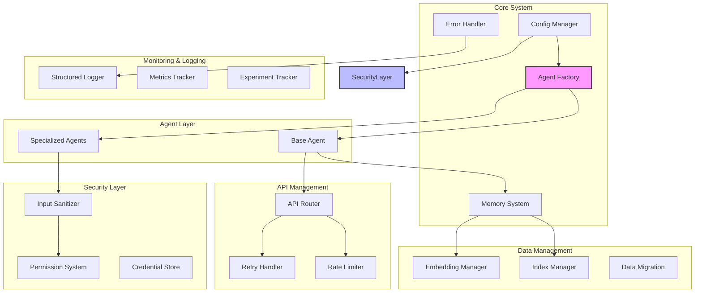
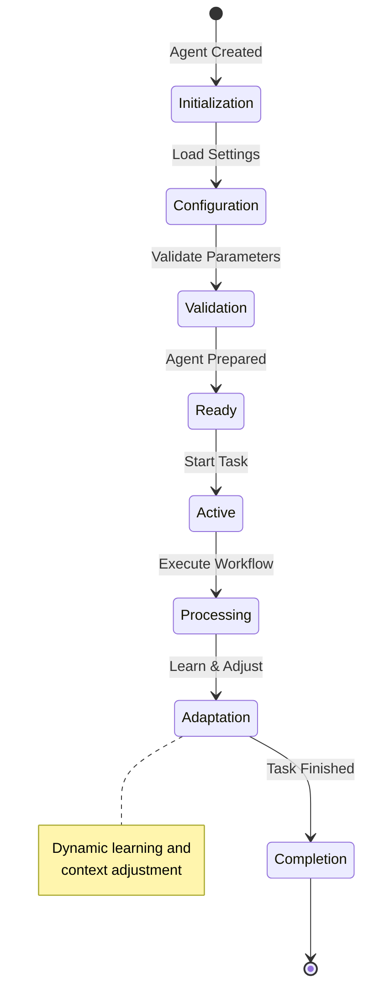
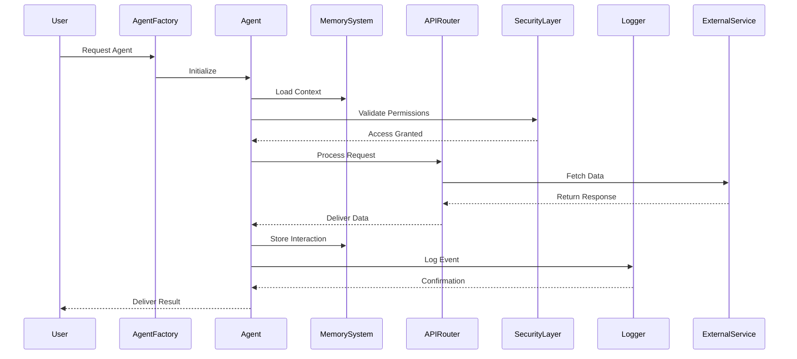

# Autonomos_AiLab: System Architecture

## Overview
Date: 3/8/2025
Version: 1.0.0

## Table of Contents
- [System Overview](#system-overview)
- [Architecture Principles](#architecture-principles)
- [Component Diagram](#component-diagram)
- [Agent Lifecycle](#agent-lifecycle)
- [Data Flow](#data-flow)
- [Interaction Patterns](#interaction-patterns)
- [Extensibility](#extensibility)

## System Overview

Autonomos_AiLab is designed as a modular, extensible AI agent system that prioritizes flexibility, security, and performance. Our architecture is built on principles of separation of concerns, dynamic composition, and adaptive intelligence.

## Architecture Principles

1. **Modularity**: Each component is loosely coupled and independently deployable
2. **Adaptability**: System can dynamically reconfigure agents and workflows
3. **Security**: Comprehensive protection at every layer
4. **Performance**: Optimized resource allocation and processing
5. **Scalability**: Designed to grow and handle increasing complexity

## Component Diagram

## Agent Lifecycle

## Data Flow

## Interaction Patterns

1. **Factory Method**: Dynamic agent creation
2. **Strategy Pattern**: Interchangeable agent behaviors
3. **Circuit Breaker**: Resilient API interactions
4. **Decorator**: Extensible agent capabilities

## Extensibility

### Agent Extension
- Inherit from `BaseAgent`
- Implement specialized methods
- Override default behaviors
- Use dependency injection

### API Integration
- Plug into `APIRouter`
- Implement standard interface
- Use retry and rate-limiting mechanisms

### Security Customization
- Extend `PermissionSystem`
- Create custom input sanitizers
- Implement context-specific validation

## Performance Optimization

- Lazy loading of agent components
- Adaptive caching strategies
- Efficient memory management
- Parallel processing capabilities

## Conclusion

The Autonomos_AiLab architecture provides a robust, flexible framework for building intelligent, adaptive AI agents. By prioritizing modularity, security, and performance, we enable rapid development and deployment of sophisticated AI solutions.

---

**Autonomos_AiLab** - Intelligent Systems, Infinite Potential
